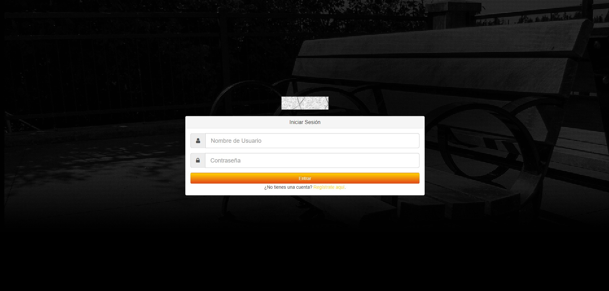
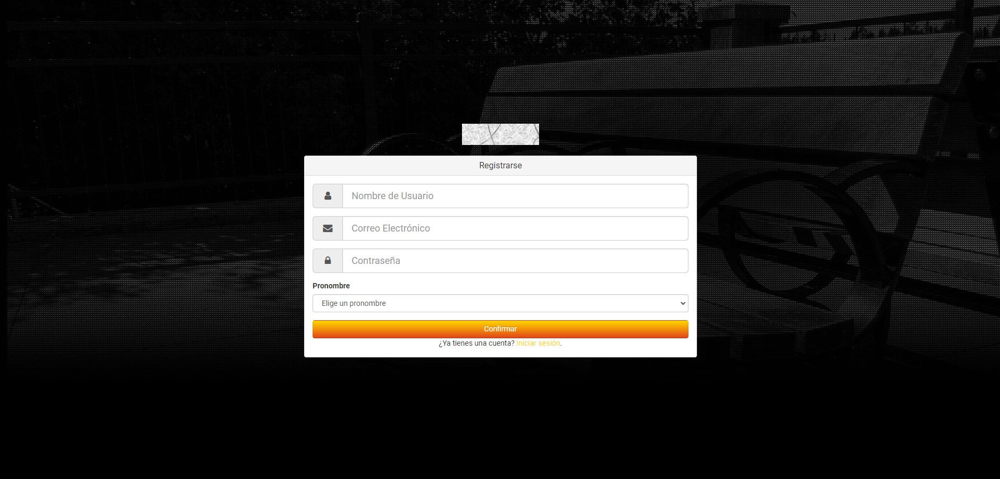
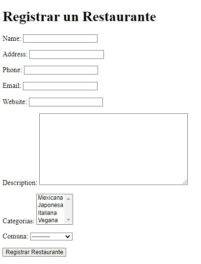
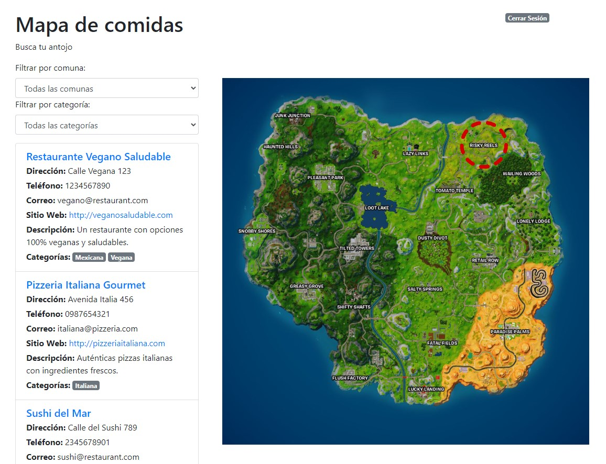
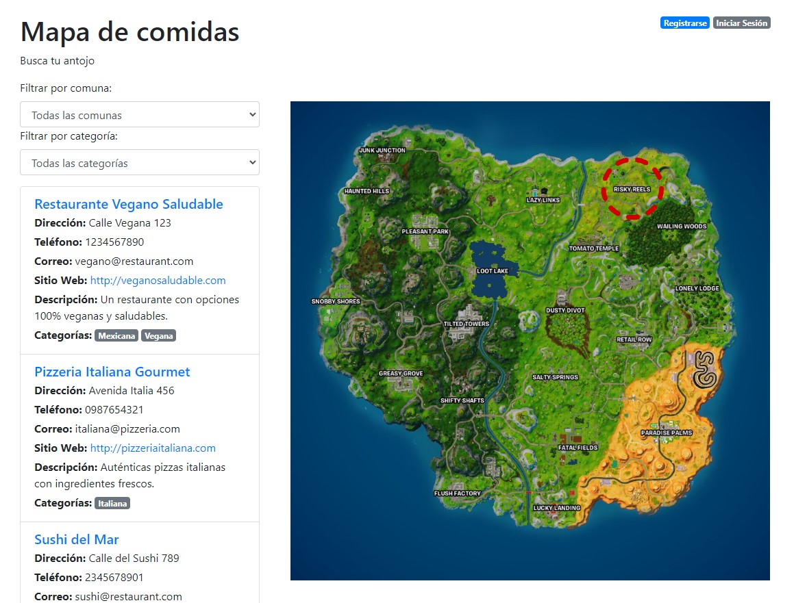
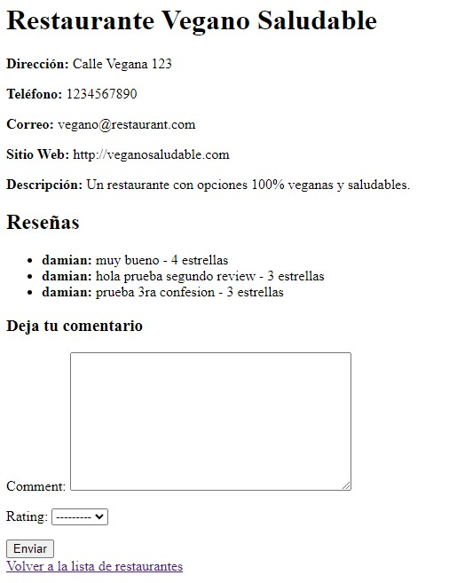
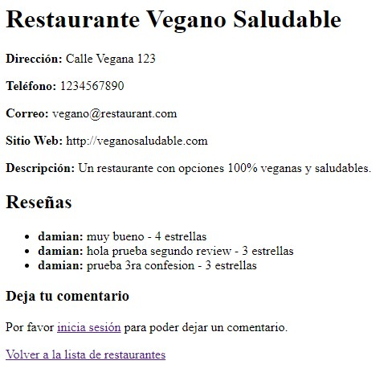

# FoodMap

FoodMap es un proyecto que consite en una aplicación web implementada con Django desarrollada por estudiantes pertenecientes a la Facultad de Ciencias Físicas y Matemáticas de la Universidad de Chile. Esta aplicación se encuentra relacionada al ámbito gastronómico, permitiéndole al usuario obtener una lista de restaurantes que se ajusten a sus preferencias, como por ejemplo, disponibilidad de comida vegana, ubicación en una comuna específica, etc...

Estos usuarios pueden visitar la aplicación web de manera anónima, o bien pueden registrarse, con lo que adquieren la capacidad de llevar a cabo más acciones, como por ejemplo dejar reviews a restaurantes. En estas reviews, se considera un input de texto, así como una puntuación de entre 1 a 5.

## Interfaces

La aplicación web consta de múltiples interfaces. A continuación se muestra la visualización de de estas, junto a una breve descripción de cada una, así como lo que el usuario puede hacer en cada una de ellas.

### Interfaz de Login
En esta interfaz lo que hacemos es permitir que un usuario ingrese a la aplicación web con su cuenta, usando su nombre y su contraseña.



### Interfaz de Registro de Usuario/Restaurante
En esta interfaz de registro de usuario se registran los datos de nuevos usuarios de la aplicación web que deseen crear su cuenta para obtener acceso a funcionalidades extra.



En la interfaz de registro de restaurantes se registran los datos de un nuevo restaurante que posteriormente se encontrará en la lista de nuestra aplicación.



### Interfaz de Lista de Restaurantes
Notemos que la vista de esta interfaz depende de si el usuario ha hecho log in o no. En caso de haber iniciado sesión, el usuario verá un cuadro en la esquina superior derecha desde el cual podrá cerrarla, como se ve en la primera imagen.



En el caso de que el usuario no haya iniciado sesión, en la esquina superior derecha aparecerán dos cuadros, en los cuales el usuario puede optar por registrarse, si es que no tiene una cuenta ya creada, o bien iniciar su sesión, si es que sí la tiene, como se ve en la imagen a continuación.




### Interfaz de Restaurante en particular
Por último, se tiene la interfaz de restaurantes en particular. Para llegar a este tipo de interfaz, el usuario debe apretar sobre el restaurante que le interese en la interfaz en donde se aprecia la lista de restaurantes(mencionada anteriormente). Aquí, si el usuario ha inciado sesión, podrá dejar reviews (texto y una puntuación de 1 a 5), como se ve en la primera imagen. De estar navegando la aplicación web de manera anónima, en lugar de observar el formulario para poder dejar reviews, se mostrará una línea de texto en donde se le pide al usuario que haga log in para acceder a aquella funcionalidad.  De esta interfaz se puede volver a la lista de restaurantes al presionar el link que se encuentra al pie de la página.






## Características
- Sistema de registro e inicio de sesión para los usuarios
- Sistema de registro de restaurantes.
- Opción de evaluación de restaurantes en cuanto a calidad (de 1 a 5).
- Opción para registrar comentarios sobre un restaurante particular.


## Herramientas utilizadas
- **Django**: Un framework de desarrollo web escrito en Python
- **Python**: Lenguaje de programación usado para la lógica del Back End
- **HTML, CSS** : Herramientas de Front End que permiten que el usuario pueda visualizar las distintas interfaces.
- **Archivos JSON**: Utilizados para cargar datos predefinidos en el sistema, como las categorías de comida, las comunas y los restaurantes.

## Instalación
Para poder interactuar con la aplicación web, se deben seguir los siguientes pasos:

1. Crear un nuevo directorio
```
mkdir grupo2-2024
cd grupo2-2024
```
2. Crear e inicializar un nuevo ambiente virtual
```
python -m venv sprint1
sprint1/Scripts/activate (windows)
$source sprint1/bin/activate (Linux)
```
3. Clonar el repositorio en el directorio
```
git clone https://github.com/DCC-CC4401/2024-2-CC4401-grupo-2.git
```
4. Asegurar que tengamos la ultima versión de pip instalada en el ambiente virtual (sprint1)
```
(sprint1) python -m pip install --upgrade pip
```
5. Entrar a la carpeta donde está el proyecto
```
(sprint1) cd 2024-2-CC4401-grupo-2
```
6. Instalar los paquetes que el proyecto requiere
```
(sprint1) python -m pip install -r requirements.txt
```
7. Actualizar las tablas
```
(sprint1) python manage.py migrate
```
8. Agregar datos para visualización
```
(sprint1) python manage.py loaddata categorias/categorias.json
(sprint1) python manage.py loaddata comunas/comunas.json
(sprint1) python manage.py loaddata restaurant.json
```
9. Iniciar el servidor de Django
```
(sprint1) python manage.py runserver
```
Habiendo completado estos pasos, debería ser posible acceder a la aplicación web y navegar las distintas interfaces dentro de esta, pudiendo llevar a cabo las funcionalidades descritas en las secciones anteriores.