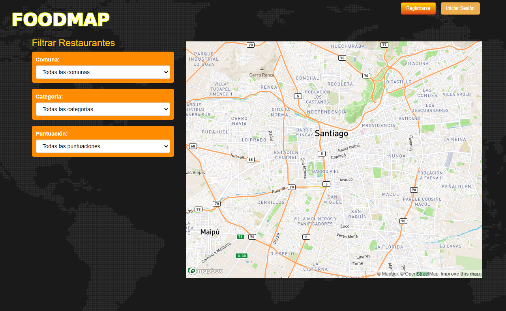
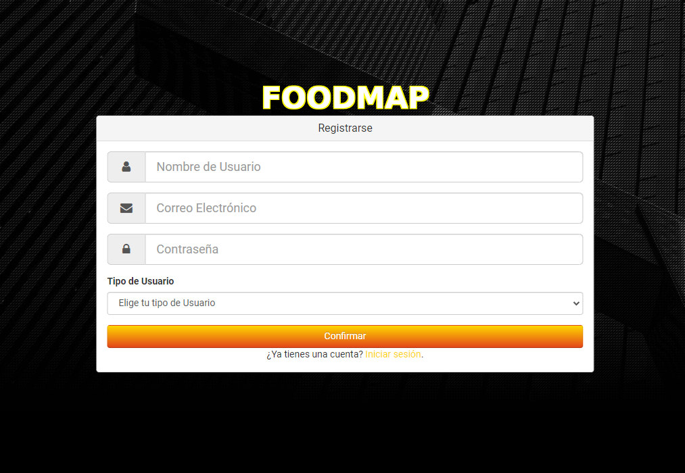
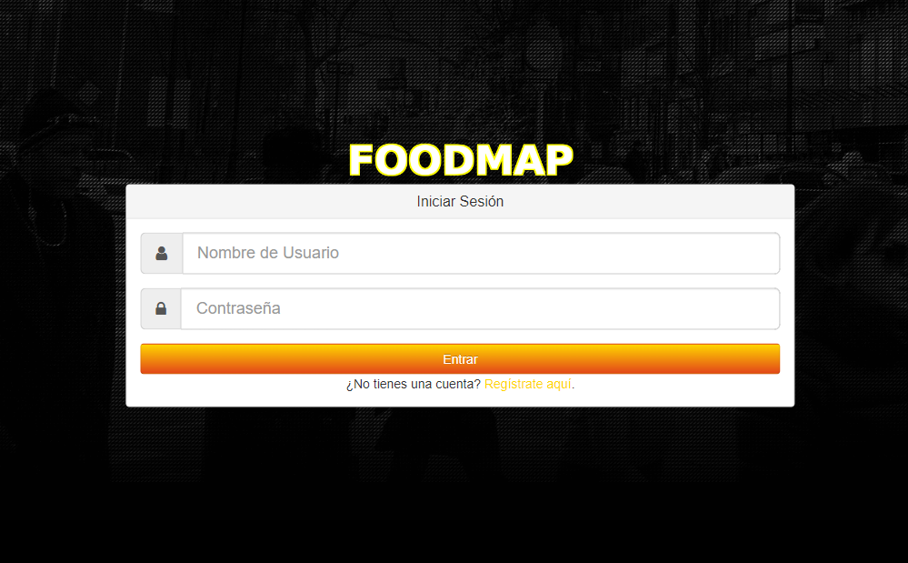
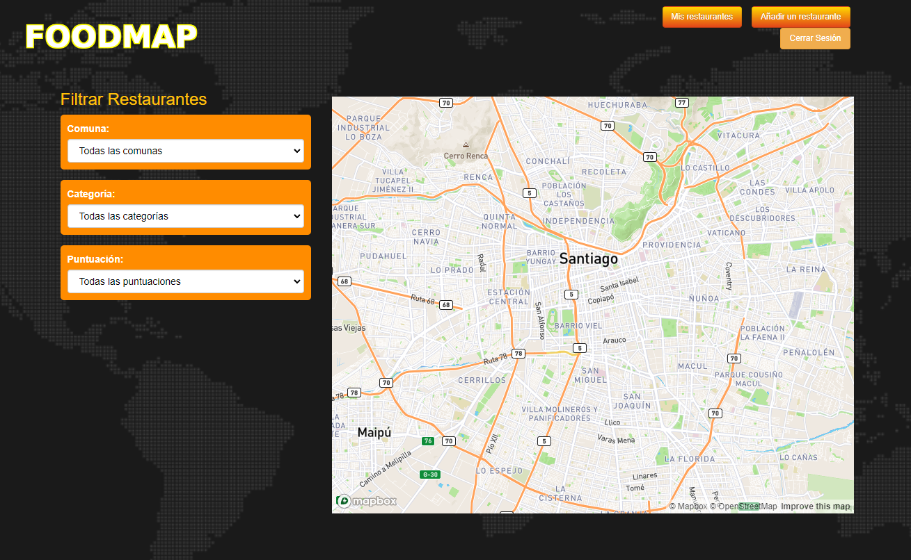
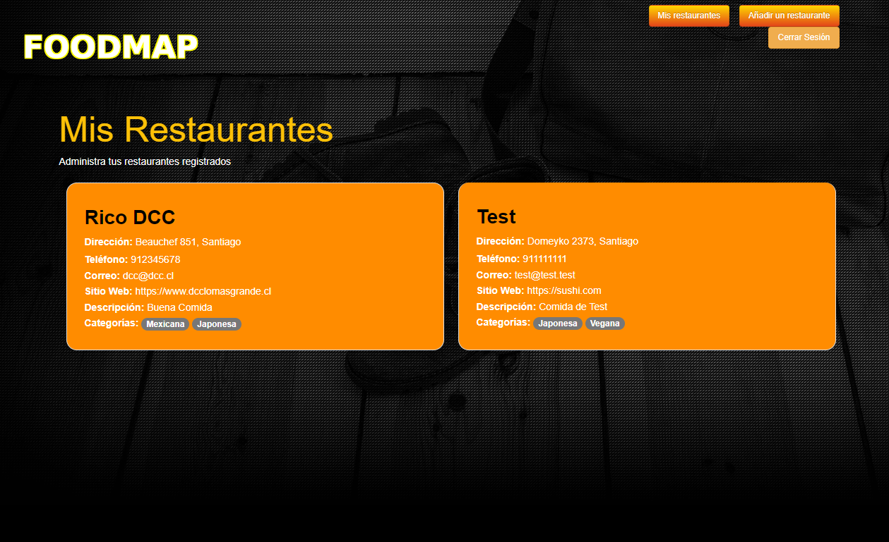
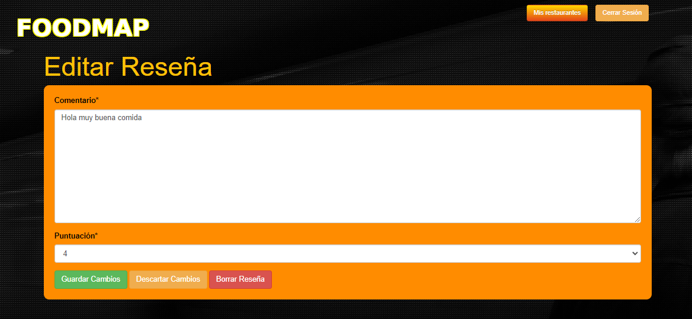
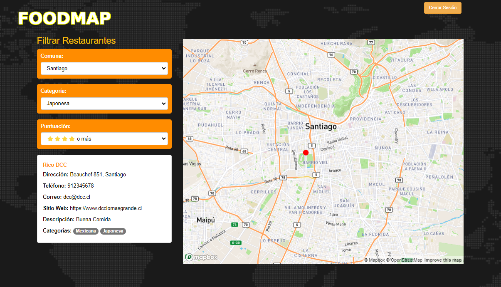

# FoodMap

FoodMap es un proyecto que consite en una aplicación web implementada con Django desarrollada por estudiantes pertenecientes a la Facultad de Ciencias Físicas y Matemáticas de la Universidad de Chile. Esta aplicación se encuentra relacionada al ámbito gastronómico, permitiéndole al usuario obtener una lista de restaurantes que se ajusten a sus preferencias, como por ejemplo, disponibilidad de comida vegana, ubicación en una comuna específica, etc...

Estos usuarios pueden visitar la aplicación web de manera anónima, o bien pueden registrarse, con lo que adquieren la capacidad de llevar a cabo más acciones, como por ejemplo dejar reviews a restaurantes. En estas reviews, se considera un input de texto, así como una puntuación de entre 1 a 5.

## Interfaces

La aplicación web consta de múltiples interfaces. A continuación se muestra la visualización de de estas, junto a una breve descripción de cada una, así como lo que el usuario puede hacer en cada una de ellas.

### Interfaz Principal/Listado de restaurantes
Esta es la primera interfaz que se ve al iniciar la aplicación web. En este apartado uno puede Registrarse o Iniciar Sesión. En el lado izquierdo es donde se colocarán los restaurantes al momento de registrarlos y se mostrarán en el mapa interactivo del lado derecho.



### Interfaz de Registro de Cliente/Propietario
Esta es la interfaz a la hora de dar de alta tanto Clientes como Propietarios de Restaurantes, que dependiendo del tipo de usuario, son las funcionalidades que tendrán en el resto de interfaces.



### Interfaz de Login
En esta interfaz lo que hacemos es permitir que un Usuario/Propietario ingrese a la aplicación web con su cuenta, usando su nombre y su contraseña.



### Interfaz Principal para un Propietario
Esta interfaz es el Menú Principal, pero con las funcionalidades extras que tiene un Propietario, es decir que puede agregar y visualizar sus restaurantes agregados.



### Interfaz para Añadir Restaurantes
Al hacer clic en la sección Añadir un Restaurante, serás redirigido a la pestaña para dar de alta dicho restaurante con su información correspondiente.


### Interfaz para ver "mis restaurantes"
Al finalizar el registro del restaurante, el Propietario es enviado a la Interfaz “Mis Restaurantes”, donde se muestran los restaurantes agregados por dicho Propietario.



### Interfaz Principal para un Propietario despues de agregar un restaurante
Esta interfaz es el mismo Menú Principal, pero ahora con el restaurante agregado y visible en el mapa interactivo.


### Interfaz datos de un Restaurante
Al hacer clic en el nombre del restaurante desde el menú principal, se le mostrará la interfaz de datos del restaurante, que muestra la información del restaurante, junto a las reseñas de los clientes y propietarios. Si el usuario está logueado podrá realizar reseñas, con una puntuación de 1 a 5.


### Interfaz para editar una review
Esta es la interfaz para editar tu propia reseña, no es posible editar las reseñas de otros usuarios, pero aquí puedes cambiar el contenido, eliminar la reseña o volver a la interfaz de datos del restaurante anterior sin realizar ningún cambio.



### Interfaz Principal para un Cliente
Esta interfaz es el Menú Principal, pero desde el punto de vista del Cliente, donde no hay funcionalidades extras para agregar y ver restaurantes.



## Características
- Sistema de registro e inicio de sesión para los usuarios y propietarios.
- Sistema de registro de restaurantes para propietarios.
- Varios filtros para mostrar diferentes restaurantes según la preferencia del usuario.
- Opción de evaluación de restaurantes en cuanto a calidad (de 1 a 5).
- Opción para registrar y editar sus comentarios comentarios sobre un restaurante particular.


## Herramientas utilizadas
- **Django**: Un framework de desarrollo web escrito en Python
- **Python**: Lenguaje de programación usado para la lógica del Back End
- **HTML, CSS** : Herramientas de Front End que permiten que el usuario pueda visualizar las distintas interfaces.
- **Archivos JSON**: Utilizados para cargar datos predefinidos en el sistema, como las categorías de comida y las comunas.

## Instalación
Para poder interactuar con la aplicación web, se deben seguir los siguientes pasos:

1. Crear un nuevo directorio
```
mkdir grupo2-2024
cd grupo2-2024
```
2. Crear e inicializar un nuevo ambiente virtual
```
python -m venv sprint1
sprint1/Scripts/activate (windows)
$source sprint1/bin/activate (Linux)
```
3. Clonar el repositorio en el directorio
```
git clone https://github.com/DCC-CC4401/2024-2-CC4401-grupo-2.git
```
4. Asegurar que tengamos la ultima versión de pip instalada en el ambiente virtual (sprint1)
```
(sprint1) python -m pip install --upgrade pip
```
5. Entrar a la carpeta donde está el proyecto
```
(sprint1) cd 2024-2-CC4401-grupo-2
```
6. Instalar los paquetes que el proyecto requiere
```
(sprint1) python -m pip install -r requirements.txt
```
7. Actualizar las tablas
```
(sprint1) python manage.py migrate
```
8. Agregar datos para visualización
```
(sprint1) python manage.py loaddata categorias/categorias.json
(sprint1) python manage.py loaddata comunas/comunas.json
```
9. Iniciar el servidor de Django
```
(sprint1) python manage.py runserver
```
Habiendo completado estos pasos, debería ser posible acceder a la aplicación web y navegar las distintas interfaces dentro de esta, pudiendo llevar a cabo las funcionalidades descritas en las secciones anteriores.